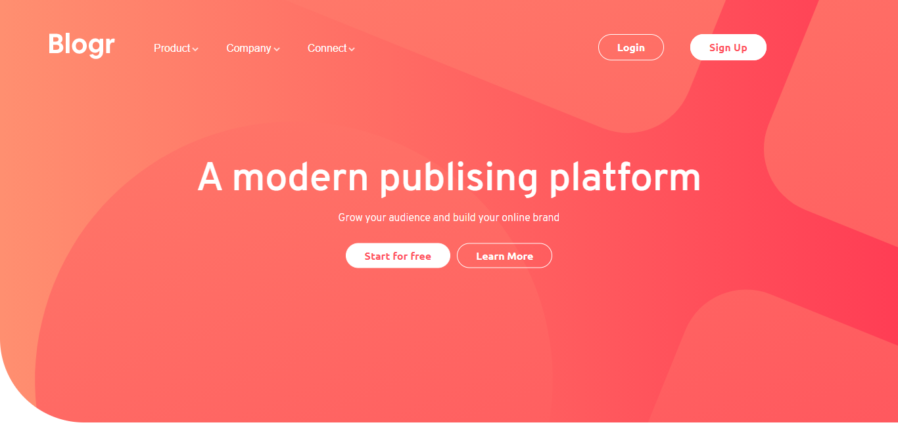

# Frontend Mentor - Blogr landing page solution

This is a solution to the [Blogr landing page challenge on Frontend Mentor](https://www.frontendmentor.io/challenges/blogr-landing-page-EX2RLAApP). Frontend Mentor challenges help you improve your coding skills by building realistic projects. 

## Table of contents

- [Overview](#overview)
  - [The challenge](#the-challenge)
  - [Screenshot](#screenshot)
  - [Links](#links)
- [My process](#my-process)
  - [Built with](#built-with)
- [Author](#author)

**Note: Delete this note and update the table of contents based on what sections you keep.**

## Overview
This project was one of the most difficult projects I've made, specially the media query part.

### The challenge

Users should be able to:

- View the optimal layout for the site depending on their device's screen size
- See hover states for all interactive elements on the page

### Screenshot

### Links

- Solution URL: [Add solution URL here](https://www.frontendmentor.io/challenges/blogr-landing-page-EX2RLAApP/hub/blogr-landing-page-with-sass-glq6DHO5W)
- Live Site URL: [Add live site URL here](https://eltonnrs.github.io/blogr-landing-page-main/)

## My process

I started with the header, using BEM to style things and trying to maintain different portions
of my sass code organized through comments and a methodology a little bit like 7-1.

### Built with

- Semantic HTML5 markup
- Flexbox
- SASS

## Author

- Website - [Elton](https://eltonnrs.github.io/Portfolio/)
- Frontend Mentor - [@eltonnrs](https://www.frontendmentor.io/profile/eltonnrs)
- Twitter - [@eltonnrs](https://www.twitter.com/eltonnrs)

